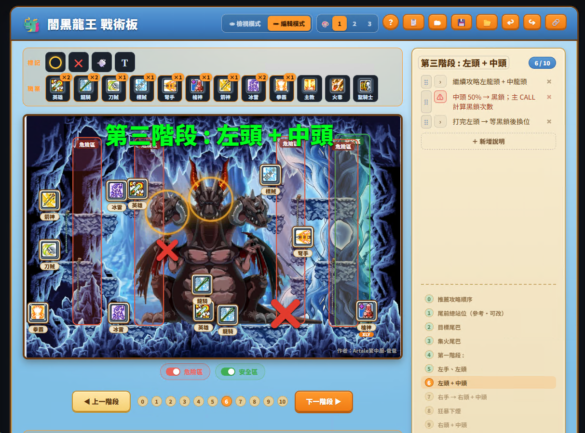

# 闇黑龍王 互動攻略模擬器

楓之谷「闇黑龍王」走位攻略的互動模擬器。在地圖上分階段呈現各職站位、目標（〇）、已斷（✕）、危險／安全／下煙區，可自行編排後分享。

## 線上開啟

👉 <https://lancelotwang114.github.io/horntail-simulator/>

## 看

- 「上一／下一階段」或鍵盤 `←` `→` 切換
- 〇＝目標、✕＝已斷、紅框＝危險、綠框＝安全、灰框＝下煙

## 編（按「✏ 編輯模式」）

- 拖曳職業圖示調位置；點圖示可命名，同職業可放多個
- 加 〇／✕／下煙／文字、改標題與說明、增刪與排序階段
- 選取物件後：右下角把手縮放、方向鍵微調、刪除
- 編輯會自動暫存在瀏覽器

## 做一份自己的版本

1. 進編輯模式改成你的內容（可從空白頁開始）。
2. 按 **「💾 存檔」** 存成你自己的 JSON。
3. 下次回到本頁 → **「📂 讀取」** 載入 → 繼續改 → 再「💾 存檔」覆蓋。

> 「💾 存檔」直接覆蓋檔案需用 Chrome／Edge；其他瀏覽器會自動改成下載。

## 分享

編輯模式按 **「🔗 分享連結」**，把連結傳給朋友，打開即為唯讀檢視（需用線上版才能給別人開）。
